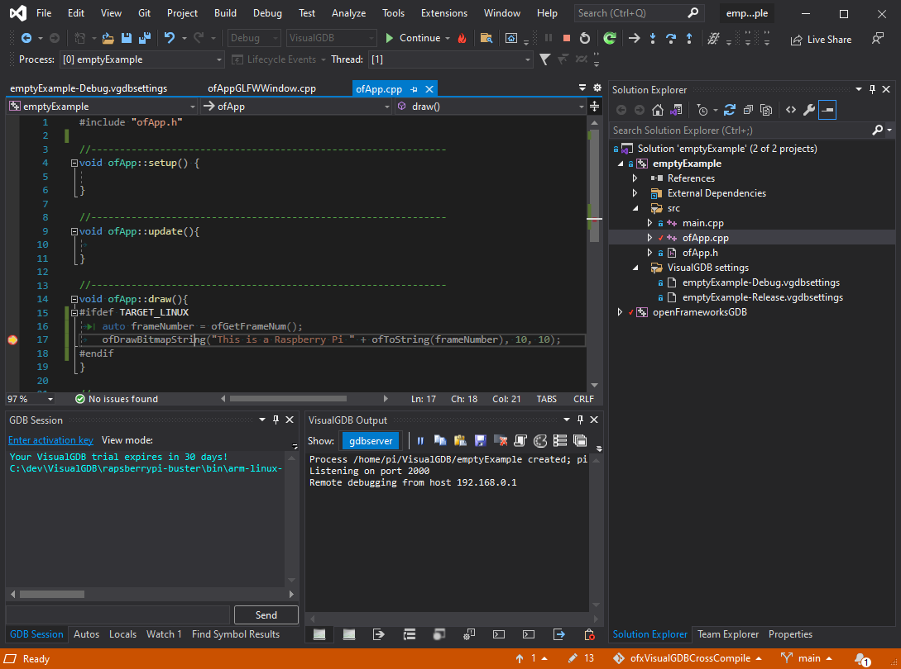

# Introduction

Cross compilation support of openFrameworks for the Raspberry Pi when developing in Windows using VisualGDB / Visual Studio.

Supports:

* Cross compiling
* Remote deployment
* Debugging

Check [https://forum.openframeworks.cc/t/cross-compiling-for-raspberry-pi-from-windows/39645] for more details.

# Notes

* You will need to have the raspberry pi libraries in your local openFrameworks folders e.g. `openFrameworks/libs/tess2/lib/linuxarmv6l`. 
* If you get errors about including KISS FFT headers, then make sure that the define `TARGET_NO_SOUND` is working correctly for your project (sometimes the inherited settings can break due to complications in the way projects work with `.props` under VisualGDB).

# Recommendations

* Copy the `emptyExample.vcxproj` and `emptyExample.sln` into your project folder.
* Don't try to mix VisualGDB projects/solutions with Win32/x64 projects/solutions (e.g. call is `MyAppGDB.sln`, etc)